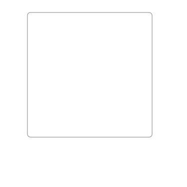

# @svag/shadow

[](https://npmjs.org/package/@svag/shadow)

`@svag/shadow` is a shadow from a window.

```sh
yarn add -E @svag/shadow
```

## Table Of Contents

- [Table Of Contents](#table-of-contents)
- [API](#api)
  * [`shadow(options: ShadowOptions)`](#shadowoptions-shadowoptions-void)
    * [`ShadowOptions`](#shadowoptions)
- [TODO](#todo)
- [Copyright](#copyright)

## API

The package is available by importing its default function:

```js
import shadow from '@svag/shadow'
```

### `shadow(`<br/>&nbsp;&nbsp;`options: ShadowOptions,`<br/>`): void`

Creates a shadow for a window with given width and height.

__<a name="shadowoptions">`ShadowOptions`</a>__: Options to generate macOS like  shadow using a blur filter.

| Name | Type | Description | Default |
| ---- | ---- | ----------- | ------- |
| __width*__ | _number_ | The width of the window. | - |
| __height*__ | _number_ | The height of the window. | - |
| offsetY | _number_ | The offset from the top of the window. | `25` |
| stdDeviation | _number_ | The standard deviation for the blur. It will spread twice this distance in each direction. | `27.5` |

```js
import Shadow from '@svag/shadow'

const shadow = Shadow({
  width: 250,
  height: 250,
})

console.log(shadow)
```

```svg
<defs>
  <filter x="-22%" y="-10%" width="144%" height="142%" id="shadow">
    <feOffset dx="0" dy="25" in="SourceAlpha" result="so"/>
    <feGaussianBlur stdDeviation="27.5" in="so" result="sb"/>
    <feColorMatrix values="0 0 0 0 0   0 0 0 0 0   0 0 0 0 0  0 0 0 0.5 0" type="matrix" in="sb" result="sm"/>
    <feMerge>
      <feMergeNode in="sm"/>
      <feMergeNode in="SourceGraphic"/>
    </feMerge>
  </filter>
</defs>
```



## TODO

- [ ] Add a new item to the todo list.

## Copyright

(c) [SVaG][1] 2018

[1]: https://svag.co
